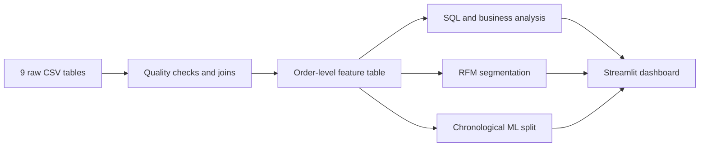

# Olist Commerce Intelligence

An end-to-end analytics and data-science case study built from 99,441 anonymized Brazilian marketplace orders. The project connects nine relational tables, answers commercial and operational questions with SQL, segments customers, and predicts late deliveries using only information available at checkout.

## Business problem

Marketplace teams need to understand where revenue comes from, why customer experience varies, and which orders deserve proactive operational attention. This project provides:

- an executive dashboard for revenue, customer and delivery KPIs;
- reproducible SQL analyses across products, customers, sellers and orders;
- RFM customer segmentation with explicit limitations;
- a leakage-aware classifier that ranks late-delivery risk.

## Headline results

| Metric | Result |
|---|---:|
| Orders | 99,441 |
| Delivered orders | 96,478 |
| Delivered revenue | R$15.42M |
| Average order value | R$159.86 |
| Late-delivery rate | 8.1% |
| On-time order review | 4.29 / 5 |
| Late order review | 2.57 / 5 |
| Repeat-customer rate | 3.0% |

The final logistic regression reaches **0.721 ROC-AUC** and **0.117 PR-AUC** on the newest 20% of orders. The test-period late rate is 5.3%, so PR-AUC is emphasized over accuracy. At the validation-selected threshold, recall is 45.0% and precision is 10.4%. These results support risk ranking and operational triage; they are not presented as production performance.

## Method



The model is trained on the oldest 80% of delivered orders and tested on the newest 20%. Delivery timestamps, review scores and all other post-purchase outcomes are excluded from the predictors. Logistic regression and random forest are compared against a dummy classifier; model selection uses validation PR-AUC.

## Repository structure

```text
dashboard/app.py               Interactive Streamlit dashboard and risk simulator
data/raw/                      Original CSV files; excluded from Git
data/processed/                Reproducible analysis outputs
notebooks/01_analysis_story.ipynb
reports/executive_report.md    Decision-focused results and limitations
reports/model_metrics.json     Full validation and chronological test metrics
sql/business_queries.sql       Portfolio SQL queries
src/data_pipeline.py           Joins, quality checks, features, RFM and KPI tables
src/train_model.py             Leakage-aware training and evaluation
src/build_report.py            Reproducible executive report
tests/test_pipeline.py         Distance and leakage-policy tests
```

## Run locally

Python 3.12 is recommended.

```bash
python3 -m venv .venv
.venv/bin/python -m pip install -r requirements.txt
PYTHONPATH=. .venv/bin/python -m src.download_data
PYTHONPATH=. .venv/bin/python -m src.run_all
PYTHONPATH=. .venv/bin/streamlit run dashboard/app.py
```

The source data is the [Brazilian E-Commerce Public Dataset by Olist](https://www.kaggle.com/datasets/olistbr/brazilian-ecommerce), containing approximately 100,000 orders placed between 2016 and 2018. Kaggle authentication may be required for a new download.

## Business interpretation

Late orders have materially lower review scores, but this observational relationship does not establish causality. The recommended next step is to send proactive messages or operational alerts for high-risk orders and evaluate the intervention through a controlled experiment.

RFM segmentation also has a material constraint: only about 3% of customers repeat within the observation window. The segments are useful for descriptive prioritization, but campaign lift must be measured separately.

## Reproducibility and limits

- A fixed random seed is used for the random forest.
- The train/test split follows time rather than random sampling.
- Raw data and trained artifacts are excluded from Git; all can be rebuilt from source.
- The dataset does not include inventory, carrier identity, margin or marketing exposure.
- The 2016–2018 Brazilian marketplace results should not be assumed to generalize to another company or period.

